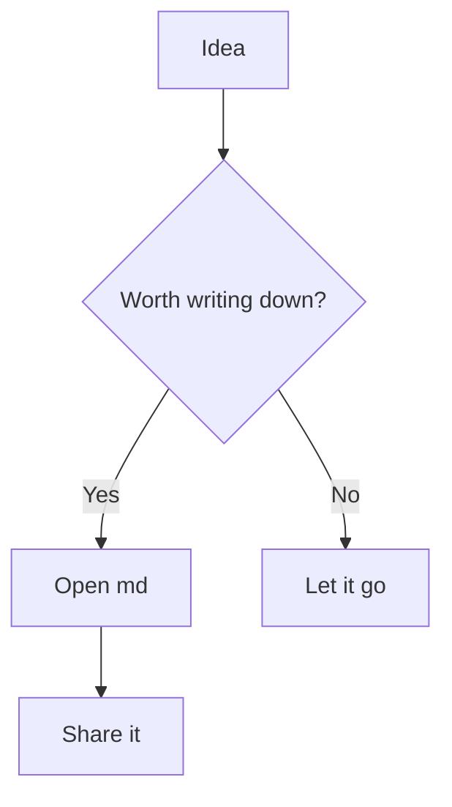
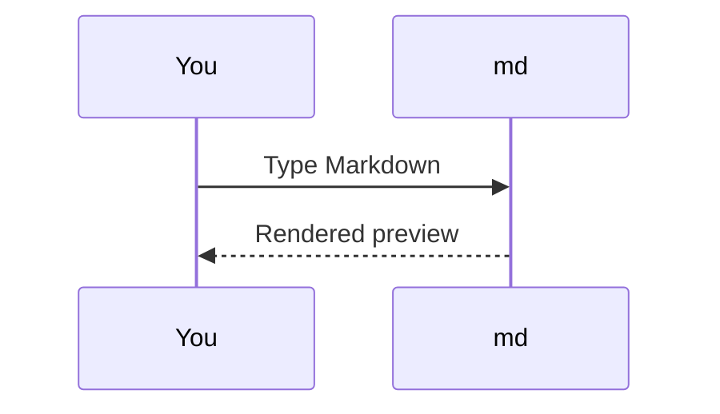
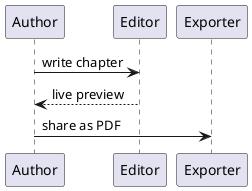

# Diagrams

Describe a diagram in text and md draws it — the Mermaid and PlantUML
engines are bundled with the app and run entirely offline.

## Mermaid

A fenced block tagged `mermaid` becomes a diagram. A flowchart:

A sequence diagram:

Mermaid also draws pie charts, state diagrams, Gantt charts, and more.

## PlantUML

A block tagged `plantuml` (or `puml`) is rendered by PlantUML — wrap the
source in `@startuml` … `@enduml`:

Because diagrams are plain text, they copy, edit, and version like prose.
