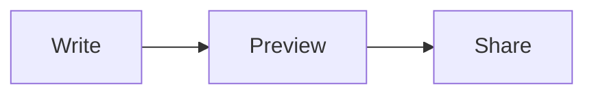

# Rich Content

Plain text goes surprisingly far. md bundles its rendering engines with
the app, so all of this works offline:

- **Math** — LaTeX between dollars, typeset by KaTeX: the area of a
  circle is $A = \pi r^2$.
- **Diagrams** — describe them in `mermaid` or `plantuml` code blocks
  and md draws them.
- **Images** — from the web, or embedded right in the file as `data:`
  URIs so they travel with the document.

A quick taste of a diagram:

Everything from the standalone examples — tables, task lists, code
blocks — works just the same inside a book article like this one.
