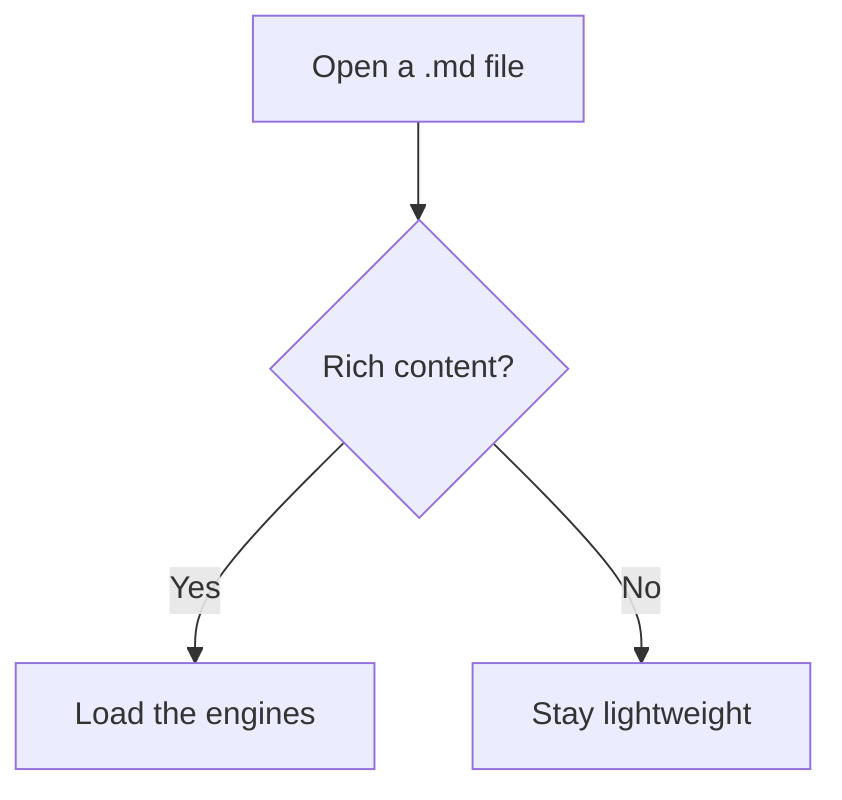
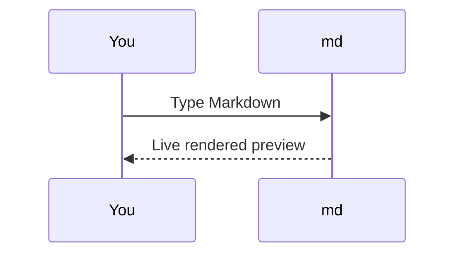
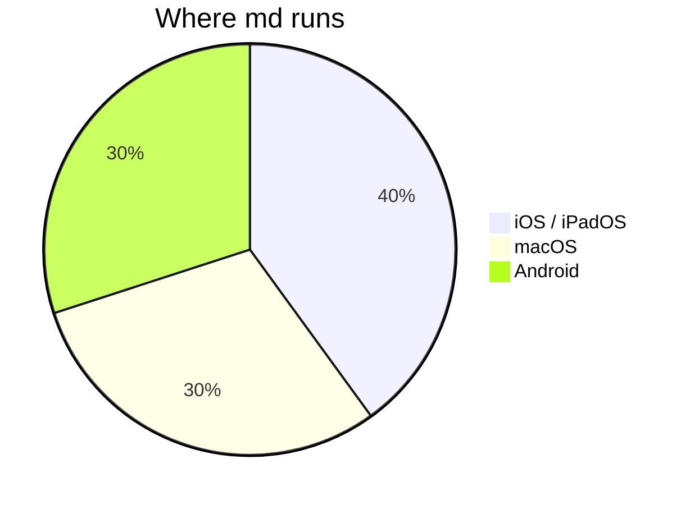

# Mermaid

A flowchart with a decision:

```mermaid
flowchart TD
  A[Open a .md file] --> B{Rich content?}
  B -->|Yes| C[Load the engines]
  B -->|No| D[Stay lightweight]
```

A sequence diagram:

```mermaid
sequenceDiagram
  participant U as You
  participant M as md
  U->>M: Type Markdown
  M-->>U: Live rendered preview
```

A pie chart:

```mermaid
pie title Where md runs
  "iOS / iPadOS" : 40
  "macOS" : 30
  "Android" : 30
```
