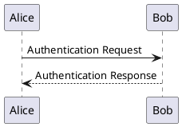
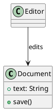
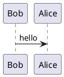

# PlantUML

A sequence diagram:

```plantuml
@startuml
Alice -> Bob: Authentication Request
Bob --> Alice: Authentication Response
@enduml
```

A class diagram:

```plantuml
@startuml
class Document {
  +text: String
  +save()
}
class Editor
Editor --> Document : edits
@enduml
```

The short alias behaves identically:

```puml
@startuml
Bob -> Alice : hello
@enduml
```
