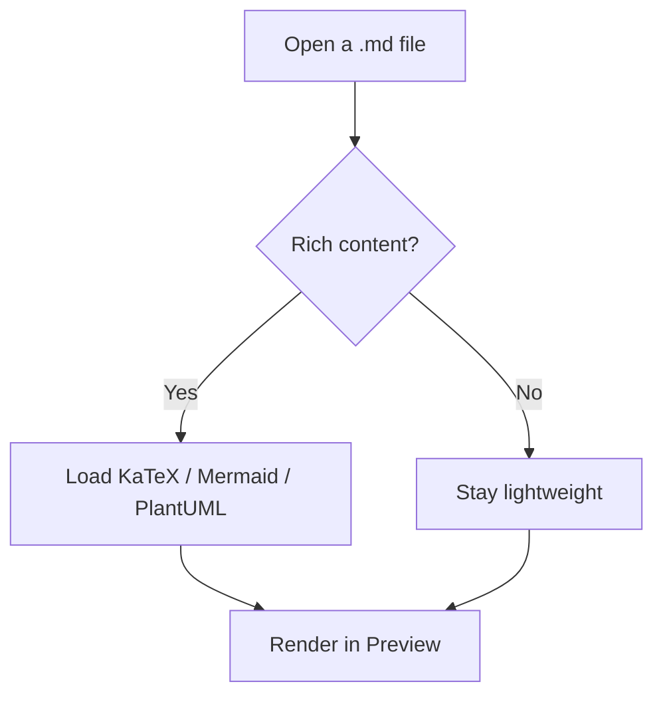
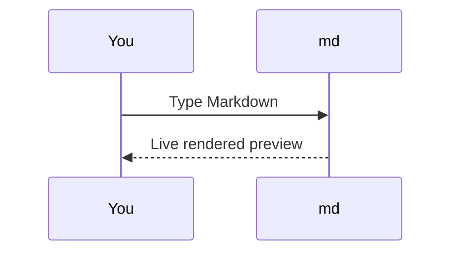
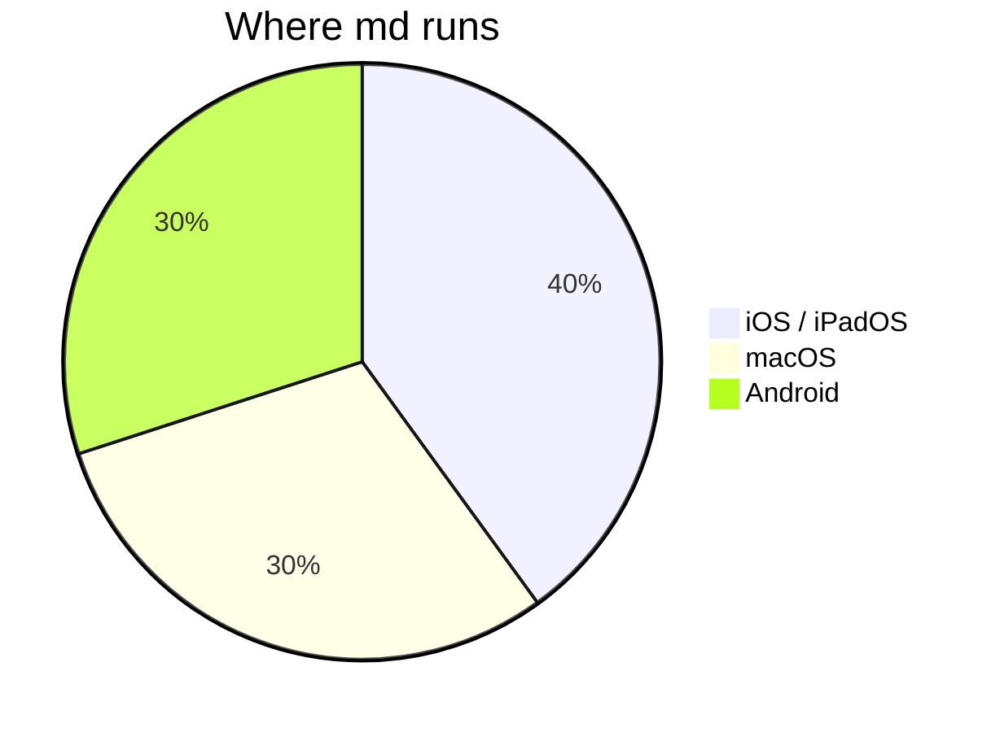
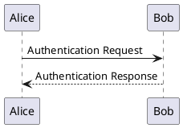
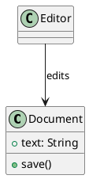
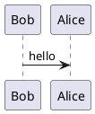

# test.md — Markdown feature reference

A single document exercising every Markdown feature the **md** renderer
supports, plus the common syntax in general. Open it in the app and flip
between **Edit**, **Split** and **Preview** to eyeball the renderer.

Sections 9–11 cover the rich content added in **1.1** — LaTeX math, Mermaid
and PlantUML diagrams. These are typeset from bundled, on-device engines
(no network) in **Preview** and the Split preview pane; in **Edit** they
appear as their raw source.

This first paragraph is plain prose. It wraps across multiple source lines
but renders as one paragraph, because a paragraph is only broken by a
blank line. Soft line breaks inside a paragraph are collapsed to spaces.

A second paragraph follows the blank line above. To force a hard line
break, end a line with two trailing spaces —  
this text is on a new line within the same paragraph.

---

## 1. Headings

# Heading level 1 (ATX)
## Heading level 2
### Heading level 3
#### Heading level 4
##### Heading level 5
###### Heading level 6

### A heading with `code`, *italics* and **bold** inline

C# and F# headings (the `#` is part of the text, not a 7th level)

Setext heading level 1
======================

Setext heading level 2
----------------------

---

## 2. Inline formatting

- **Bold** with double asterisks and __double underscores__
- *Italic* with single asterisks and _single underscores_
- ***Bold and italic together***
- `inline code` with backticks
- ~~Strikethrough~~ text
- A [link to nettrash.me](https://nettrash.me)
- A [link with a title](https://nettrash.me "Hover title")
- An autolink: <https://nettrash.me>
- An email autolink: <nettrash@nettrash.me>
- Escaped characters: \*not italic\*, \`not code\`, \# not a heading
- Mixed: **bold with `code` and _italic_ inside**

---

## 3. Blockquotes

> A simple block quote.
>
> Spanning multiple paragraphs within the same quote.

> Quotes can contain other elements:
>
> - a list item
> - another item
>
> ```
> and even a code block
> ```

> Level one
>> Level two (nested)
>>> Level three (nested deeper)

---

## 4. Lists

### Unordered

- First item
- Second item
- Third item with a longer line of text that wraps onto more than one
  visual line to check continuation alignment
* Asterisk bullets work too
+ Plus bullets work too

### Ordered

1. First
2. Second
3. Third
4. Numbers need not be sequential in source
1. (this renders as item 5)

### Nested (mixed)

1. Top level ordered
   - Nested unordered
   - Another nested item
     1. Deeper ordered
     2. Deeper ordered two
2. Back to top level
   - With a nested bullet

### Task lists

- [ ] Unchecked task
- [x] Checked task
- [ ] Task with **bold** and `code`
  - [x] Nested completed subtask
  - [ ] Nested pending subtask

---

## 5. Code

Inline `let x = 42` in a sentence.

A fenced code block with a language hint (triple backticks):

```swift
struct MarkdownDocument: FileDocument {
    var text: String
    static var readableContentTypes: [UTType] { [.markdown, .plainText] }
}
```

A fenced code block using tildes:

~~~json
{
  "name": "md",
  "platforms": ["Android"],
  "dependencies": []
}
~~~

A fenced block with no language:

```
plain preformatted text
    indentation is preserved
1 + 1 = 2
```

A code block with a very long line to check horizontal scrolling: `the quick brown fox jumps over the lazy dog and keeps on running far past the right edge of the page`:

```
this_is_a_single_unbroken_line_that_should_scroll_horizontally_rather_than_wrap_in_the_rendered_code_block_aaaaaaaaaaaaaaaaaaaaaaaaaaaaaaaaaaaaaaaaaaaaa
```

---

## 6. Tables

A GitHub-style table with default alignment:

| Feature      | Supported | Notes                     |
| ------------ | --------- | ------------------------- |
| Headings     | Yes       | ATX and setext            |
| Tables       | Yes       | With column alignment     |
| Footnotes    | Maybe     | Depends on the renderer   |

Column alignment (left, center, right):

| Left aligned | Center aligned | Right aligned |
| :----------- | :------------: | ------------: |
| a            |       b        |             c |
| longer text  |    centered    |      1,000,000 |
| x            |       y        |             z |

A table with inline formatting in cells:

| Syntax       | Renders as      |
| ------------ | --------------- |
| `**bold**`   | **bold**        |
| `*italic*`   | *italic*        |
| `~~strike~~` | ~~strike~~      |
| `[link](/)`  | [link](https://nettrash.me) |

---

## 7. Thematic breaks

Three or more of `-`, `*` or `_` on their own line:

---

***

___

---

## 8. Images

Inline image (may not render if the renderer is text-only):


A linked image:

[](https://nettrash.me)

---

## 9. Math (LaTeX)

New in **1.1**: TeX / LaTeX math is typeset by a bundled **KaTeX** engine,
entirely on-device with no network. It renders in **Preview** and the Split
preview pane; **Edit** shows the raw source.

Inline math sits in the run of text between single dollars: the Pythagorean
theorem $a^2 + b^2 = c^2$ relates the sides of a right triangle, and the
mass–energy relation is $E = mc^2$.

Characters that are Markdown syntax stay literal inside math — the asterisks
in $a*b*c$ are a product, not *emphasis*, and the underscores in $x_1 + x_2$
are subscripts. The parenthesis form works too: Euler's identity is
\(e^{i\pi} + 1 = 0\).

The currency guard keeps prose intact: it costs $5 and $10 today, and $99.99
is a price — none of these become formulas. Inside a code span it stays
literal as well, so `$x$` is code, not math.

Display math is centred on its own line with double dollars:

$$\int_0^1 x^2\,dx = \frac{1}{3}$$

…or with bracket delimiters:

\[ \sum_{k=1}^{n} k = \frac{n(n+1)}{2} \]

A whole fenced block tagged `math` (or `latex` / `tex`) is a display formula —
handy for multi-line environments:

```math
\begin{aligned}
  (a + b)^2 &= a^2 + 2ab + b^2 \\
  (a - b)^2 &= a^2 - 2ab + b^2
\end{aligned}
```

---

## 10. Mermaid diagrams

Also new in **1.1**: a ` ```mermaid ` fenced block is drawn as a diagram by the
bundled **Mermaid** engine (Preview / Split, on-device).

A flowchart with a decision:



A sequence diagram:



A pie chart:



---

## 11. PlantUML diagrams

Also new in **1.1**: a ` ```plantuml ` block (the aliases ` ```puml ` and
` ```plant-uml ` work too) is rendered on-device by the bundled **PlantUML**
engine. Wrap the source in `@startuml` … `@enduml`.

A sequence diagram:



A class diagram:



The short alias behaves identically:



---

## 12. Edge cases & mixed content

A paragraph immediately followed by a list (no blank line between, which
some parsers treat as a lazy continuation):
- item one
- item two

A list item containing a fenced code block:

1. Run the build:
   ```bash
   ./gradlew :md:assembleDebug
   ```
2. Open a `.md` file and start editing.

A blockquote that contains a table:

> | Key | Value |
> | --- | ----- |
> | a   | 1     |
> | b   | 2     |

Inline math flows through table cells and list items too (the inline pass
runs there as well):

| Symbol  | Meaning                            |
| ------- | ---------------------------------- |
| $\pi$   | ratio of circumference to diameter |
| $\tau$  | $2\pi$                             |

- The golden ratio $\varphi = \frac{1 + \sqrt5}{2}$.
- Euler's number $e \approx 2.718$.

And a formula inside a blockquote:

> A right triangle satisfies $a^2 + b^2 = c^2$.

Unicode and emoji: café, naïve, Москва, 日本語, 😀 📝 ✅.

The end. If everything above renders sensibly in **Preview** — prose,
tables, code, and the **1.1** formulas and diagrams alike — the parser,
renderer and the bundled math / diagram engines are healthy.
